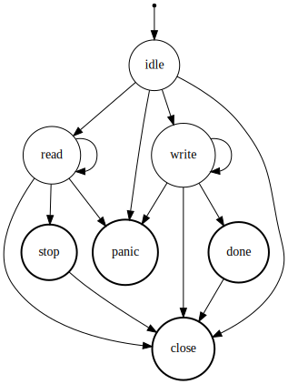

Developer's notes
=================

These notes are not for end users but rather for developers who are interested
in the design of the package.

`TranscodingStream` type
------------------------

`TranscodingStream{C,S}` (defined in src/stream.jl) has three fields:
- `codec`: data codec (`<:C where C<:Codec`)
- `stream`: data stream (`<:S where S<:IO`)
- `state`: current state (`<:State`).

A codec will be implemented by package developers and only a special codec
`Noop` is defined in this package.  A stream can be any object that implements
at least `Base.isopen`, `Base.eof`, `Base.close`, `Base.bytesavailable`,
`Base.unsafe_read`, and `Base.unsafe_write`.  All mutable fields are delegated
to `state` and hence the stream type itself is immutable.

A stream has two buffers in the `state` field. These are used to store
pre-transcoded and transcoded data in the stream. The stream passes references
of these two buffers to the codec when processing data. The following diagram
illustrates the flow of data:

    When reading data (`state.mode == :read`):
      user <--- |state.buffer1| <--- <stream.codec> <--- |state.buffer2| <--- stream

    When writing data (`state.mode == :write`):
      user ---> |state.buffer1| ---> <stream.codec> ---> |state.buffer2| ---> stream

In the read mode, a user pull out data from `state.buffer1` and pre-transcoded
data are filled in `state.buffer2`. In the write mode, a user will push data
into `state.buffer1` and transcoded data are filled in `state.buffer2`. The
default buffer size is 16KiB for each.

`State` (defined in src/state.jl) has five fields:
- `mode`: current stream mode (`<:Symbol`)
- `code`: return code of the last codec's method call (`<:Symbol`)
- `error`: exception returned by the codec (`<:Error`)
- `buffer1`: data buffer that is closer to the user (`<:Buffer`)
- `buffer2`: data buffer that is farther to the user (`<:Buffer`)

The `mode` field may be one of the following value:
- `:idle` : initial and intermediate mode, no buffered data
- `:read` : being ready to read data, data may be buffered
- `:write`: being ready to write data, data may be buffered
- `:stop` : transcoding is stopped after read, data may be buffered
- `:close`: closed, no buffered data
- `:panic`: an exception has been thrown in codec, data may be buffered but we
            cannot do anything

Note that `mode=:stop` does not mean there is no data available in the stream.
This is because transcoded data may be left in the buffer.

The initial mode is `:idle` and mode transition happens as shown in the
following diagram:

Modes surrounded by a bold circle are a state in which the transcoding stream
has released resources by calling `finalize(codec)`.  The mode transition should
happen in the `changemode!(stream, newmode)` function in src/stream.jl. Trying
an undefined transition will thrown an exception.

A transition happens according to internal or external events of the transcoding
stream. The status code and the error object returned by codec methods are
internal events, and user's method calls are external events.  For example,
calling `read(stream)` will change the mode from `:init` to `:read` and then
calling `close(stream)` will change the mode from `:read` to `:close`. When data
processing fails in the codec, a codec will return `:error` and the stream will
result in `:panic`.

Shared buffers
--------------

Adjacent transcoding streams may share their buffers. This will reduce memory
allocation and eliminate data copy between buffers.

`readdata!(input::IO, output::Buffer)` and `writedata!(output::IO,
input::Buffer)` do the actual work of read/write data from/to the underlying
stream. These methods have a special pass for shared buffers.

`Noop` codec
------------

`Noop` (`NoopStream`) is a codec that does *nothing*. It works as a buffering
layer on top of the underlying stream. Since `NoopStream` does not need to have
two distinct buffers, `buffer1` and `buffer2` in the `State` object are shared
and some specialized methods are defined for the type. All of these are defined
in src/noop.jl.
