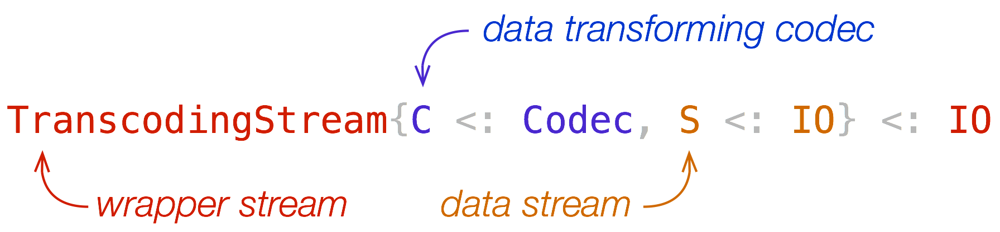

# Home



## Overview

TranscodingStreams.jl is a package for transcoding data streams. Transcoding
may be compression, decompression, ASCII encoding, and any other codec.  The
package exports a data type `TranscodingStream`, which is a subtype of `IO` and
wraps other `IO` object to transcode data read from or written to the wrapped
stream.

In this page, we introduce the basic concepts of TranscodingStreams.jl and
currently available packages. The [Examples](@ref) page demonstrates common
usage. The [Reference](@ref) page offers a comprehensive API document.

## Introduction

`TranscodingStream` has two type parameters, `C<:Codec` and `S<:IO`, and hence
the concrete data type is written as `TranscodingStream{C<:Codec,S<:IO}`. This
type wraps an underlying I/O stream `S` by a transcoding codec `C`. `C` and `S`
are orthogonal and hence you can use any combination of these two types.  The
underlying stream may be any stream that supports I/O operations defined by the
`Base` module. For example, it may be `IOStream`, `TTY`, `IOBuffer`, or
`TranscodingStream`. The codec `C` must define the transcoding protocol defined
in this package.  We already have various codecs in packages listed below.  Of
course, you can define your own codec by implementing the transcoding protocol
described in [`TranscodingStreams.Codec`](@ref).

You can install codec packages using the standard package manager. These codec
packages are independent of each other and can be installed separately. You
won't need to explicitly install the TranscodingStreams.jl package unless you
will use lower-level interfaces of it. Each codec package defines some codec
types, which is a subtype of `TranscodingStreams.Codec`, and their
corresponding transcoding stream aliases.  These aliases are partially
instantiated by a codec type; for example, `GzipDecompressionStream{S}` is an
alias of `TranscodingStream{GzipDecompressor,S}`, where `S` is a subtype of
`IO`.

```@raw html
<table>
    <tr>
        <th>Package</th>
        <th>Library</th>
        <th>Format</th>
        <th>Codec</th>
        <th>Stream alias</th>
        <th>Description</th>
    </tr>
    <tr>
        <td rowspan="6"><a href="https://github.com/bicycle1885/CodecZlib.jl">CodecZlib.jl</a></td>
        <td rowspan="6"><a href="http://zlib.net/">zlib</a></td>
        <td rowspan="2"><a href="https://tools.ietf.org/html/rfc1952">RFC1952</a></td>
        <td><code>GzipCompressor</code></td>
        <td><code>GzipCompressorStream</code></td>
        <td>Compress data in gzip (.gz) format.</td>
    </tr>
    <tr>
        <td><code>GzipDecompressor</code></td>
        <td><code>GzipDecompressorStream</code></td>
        <td>Decompress data in gzip (.gz) format.</td>
    </tr>
    <tr>
        <td rowspan="2"><a href="https://tools.ietf.org/html/rfc1950">RFC1950</a></td>
        <td><code>ZlibCompressor</code></td>
        <td><code>ZlibCompressorStream</code></td>
        <td>Compress data in zlib format.</td>
    </tr>
    <tr>
        <td><code>ZlibDecompressor</code></td>
        <td><code>ZlibDecompressorStream</code></td>
        <td>Decompress data in zlib format.</td>
    </tr>
    <tr>
        <td rowspan="2"><a href="https://tools.ietf.org/html/rfc1951">RFC1951</a></td>
        <td><code>DeflateCompressor</code></td>
        <td><code>DeflateCompressorStream</code></td>
        <td>Compress data in deflate format.</td>
    </tr>
    <tr>
        <td><code>DeflateDecompressor</code></td>
        <td><code>DeflateDecompressorStream</code></td>
        <td>Decompress data in deflate format.</td>
    </tr>
    <tr>
        <td rowspan="2"><a href="https://github.com/bicycle1885/CodecXz.jl">CodecXz.jl</a></td>
        <td rowspan="2"><a href="https://tukaani.org/xz/">xz</a></td>
        <td rowspan="2"><a href="https://tukaani.org/xz/xz-file-format.txt">The .xz File Format</a></td>
        <td><code>XzCompressor</code></td>
        <td><code>XzCompressorStream</code></td>
        <td>Compress data in xz (.xz) format.</td>
    </tr>
    <tr>
        <td><code>XzDecompressor</code></td>
        <td><code>XzDecompressorStream</code></td>
        <td>Decompress data in xz (.xz) format.</td>
    </tr>
    <tr>
        <td rowspan="2"><a href="https://github.com/bicycle1885/CodecZstd.jl">CodecZstd.jl</a></td>
        <td rowspan="2"><a href="http://facebook.github.io/zstd/">zstd</a></td>
        <td rowspan="2"><a href="https://github.com/facebook/zstd/blob/dev/doc/zstd_compression_format.md">Zstandard Compression Format</a></td>
        <td><code>ZstdCompressor</code></td>
        <td><code>ZstdCompressorStream</code></td>
        <td>Compress data in zstd (.zst) format.</td>
    </tr>
    <tr>
        <td><code>ZstdDecompressor</code></td>
        <td><code>ZstdDecompressorStream</code></td>
        <td>Decompress data in zstd (.zst) format.</td>
    </tr>
    <tr>
        <td rowspan="6"><a href="https://github.com/bicycle1885/CodecBase.jl">CodecBase.jl</a></td>
        <td rowspan="6">native</td>
        <td rowspan="6"><a href="https://tools.ietf.org/html/rfc4648">RFC4648</a></td>
        <td><code>Base16Encoder</code></td>
        <td><code>Base16EncoderStream</code></td>
        <td>Encode binary in base16 format.</td>
    </tr>
    <tr>
        <td><code>Base16Decoder</code></td>
        <td><code>Base16DecoderStream</code></td>
        <td>Decode binary in base16 format.</td>
    </tr>
    <tr>
        <td><code>Base32Encoder</code></td>
        <td><code>Base32EncoderStream</code></td>
        <td>Encode binary in base32 format.</td>
    </tr>
    <tr>
        <td><code>Base32Decoder</code></td>
        <td><code>Base32DecoderStream</code></td>
        <td>Decode binary in base32 format.</td>
    </tr>
    <tr>
        <td><code>Base64Encoder</code></td>
        <td><code>Base64EncoderStream</code></td>
        <td>Encode binary in base64 format.</td>
    </tr>
    <tr>
        <td><code>Base64Decoder</code></td>
        <td><code>Base64DecoderStream</code></td>
        <td>Decode binary in base64 format.</td>
    </tr>
    <tr>
        <td rowspan="2"><a href="https://github.com/bicycle1885/CodecBzip2.jl">CodecBzip2.jl</a></td>
        <td rowspan="2"><a href="http://www.bzip.org/">bzip2</a></td>
        <td rowspan="2"></td>
        <td><code>Bzip2Compressor</code></td>
        <td><code>Bzip2CompressorStream</code></td>
        <td>Compress data in bzip2 (.bz2) format.</td>
    </tr>
    <tr>
        <td><code>Bzip2Decompressor</code></td>
        <td><code>Bzip2DecompressorStream</code></td>
        <td>Decompress data in bzip2 (.bz2) format.</td>
    </tr>
</table>
```


## Notes

### Wrapped streams

The wrapper stream takes care of the wrapped stream. Reading or writing data
from or to the wrapped stream outside the management will result in unexpected
behaviors. When you close the wrapped stream, you must call the `close` method
of the wrapper stream, which releases allocated resources and closes the
wrapped stream.

### Error handling

You may encounter an error while processing data with this package. For
example, your compressed data may be corrupted or truncated for some reason,
and the decompressor cannot recover the original data. In such a case, the
codec informs the stream of the error, and the stream goes to an unrecoverable
mode.  In this mode, the only possible operations are `isopen` and `close`.
Other operations, such as `read` or `write`, will result in an argument error
exception. Resources allocated by the codec will be released by the stream, and
hence you must not call the finalizer of the codec.
